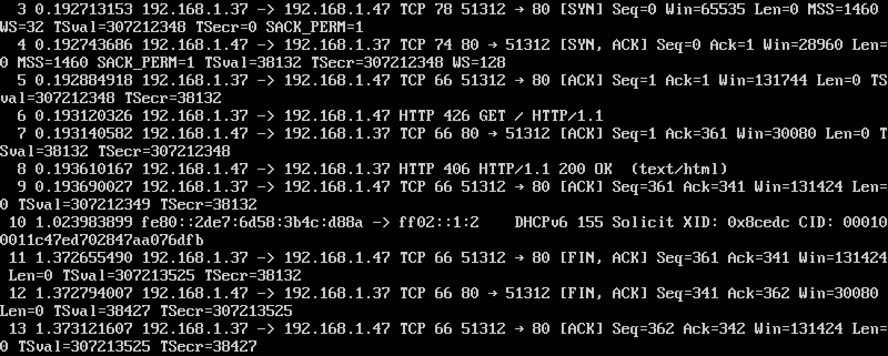

# Ejercicio 2. Instalar wireshark y observar cómo fluye el tráfico de red en uno de los servidores web mientras se le hacen peticiones HTTP.
Como en **Ubuntu Server** no tenemos interfaz gráfica, en lugar de instalar **Wireshark** tenemos que instalar **tshark**.  
He accedido con mi máquina anfitrión con ip **192.168.1.37** a la máquina virtual con ip **192.168.1.47**. El resultado del proceso de negociación (SYN, SYN/ACK, ACK) ha sido el siguiente:  
