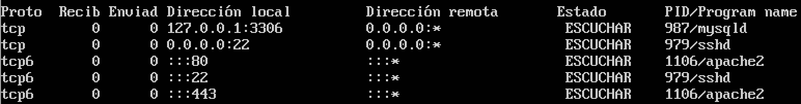

# Ejercicio 2. Comprobar qué puertos tienen abiertos nuestras máquinas, su estado, y qué programa o demonio lo ocupa.
Tanto en **Linux** como en **MacOS** se utiliza el comando `netstat`, pero con distintas opciones. En MacOS la orden es `netstat alnp tcp udp | grep -i "listen"` y en Linux `netstat -tulnp`.  
