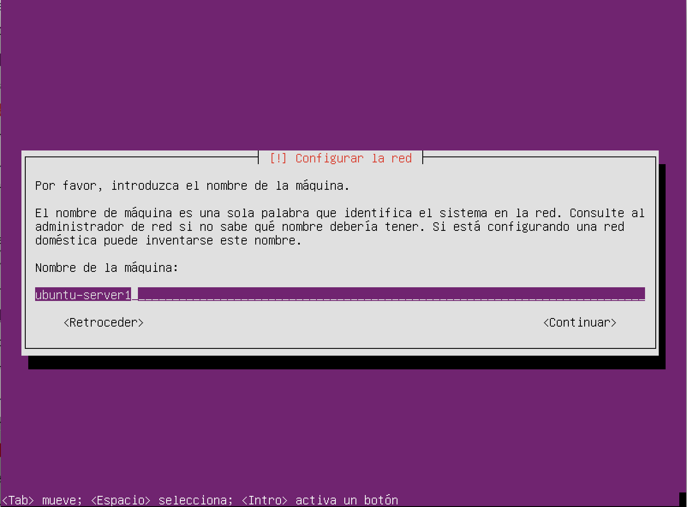
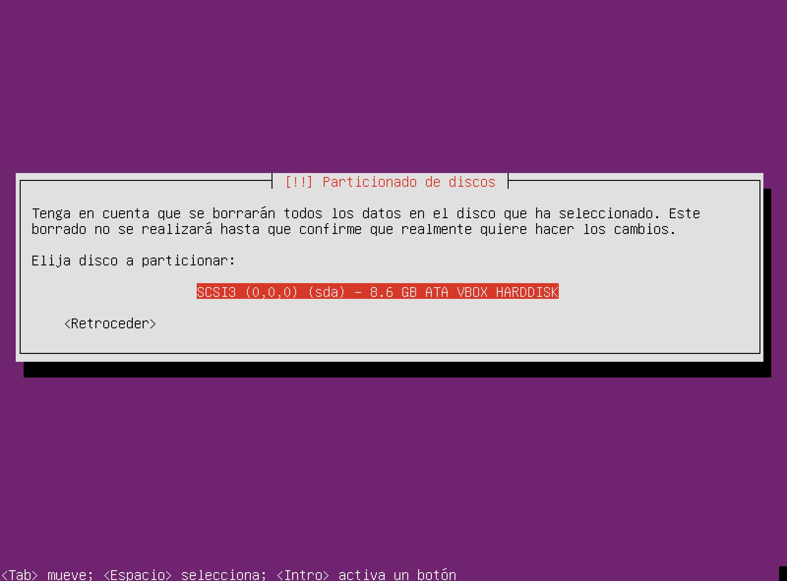
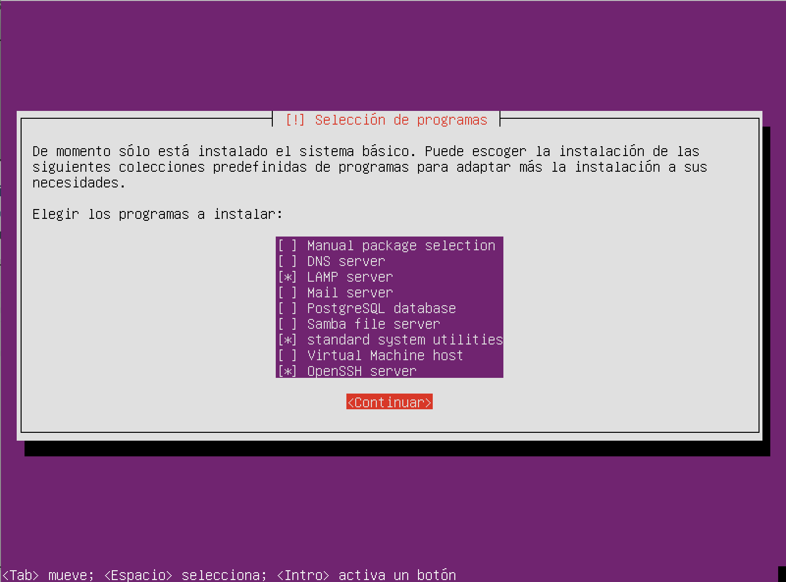
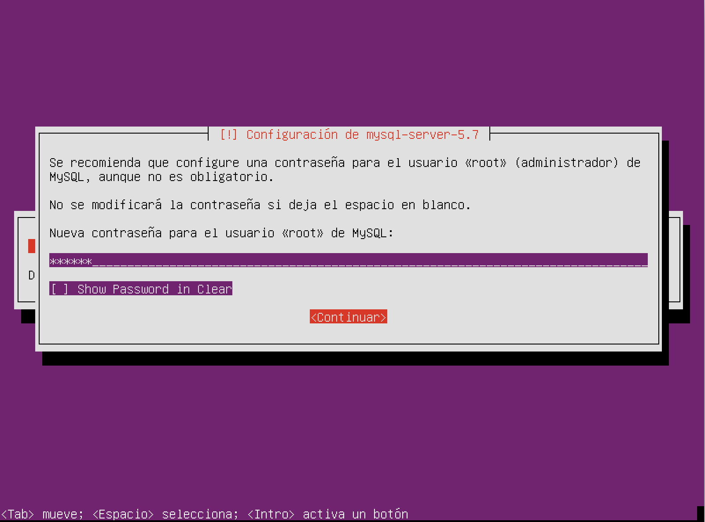
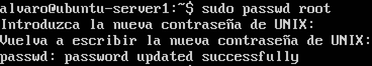
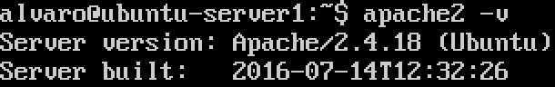
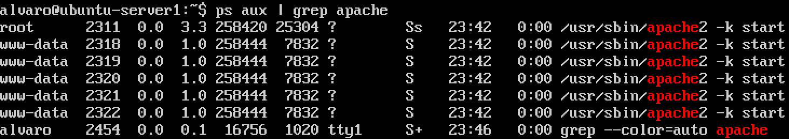
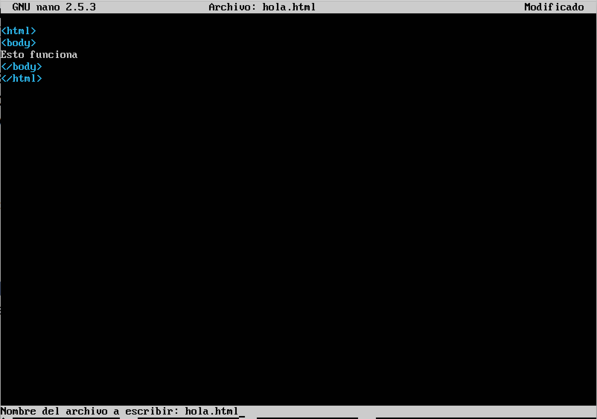
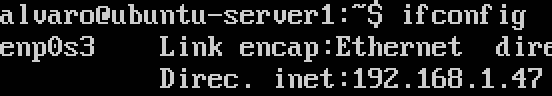
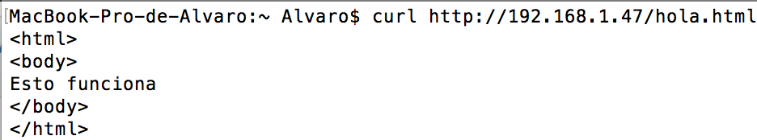

# Práctica 1. Preparación de las herramientas.
En primer lugar, descargamos la ISO de **Ubuntu Server** y procedemos a realizar la instalación siguiendo los pasos habituales.
A continuación se muestran algunos pasos de la misma:

Una vez hemos llegado al paso en el que debemos seleccionar los programas *extra* a instalar, marcamos **OpenSSH** y **LAMP** (Apache, MySQL, PHP).

Al completar la instalación, lo primero que debemos hacer es definir una **contraseña** para el usuario **root** con `sudo passwd root`.

Mostramos la versión de **Apache** con el comando `apache2 -v`.

Podemos ver que Apache se encuentra en ejecución con `ps aux | grep apache`.

Creamos un **archivo HTML** para comprobar el funcionamiento de Apache.

Consultamos la **ip** de la máquina virtual con el comando `ifconfig`. En el apartado *Red* de la configuración de la máquina virtual es importante haber seleccionado el **adaptador puente** (Bridge). Esto nos permitirá acceder a la ip de la máquina virtual en nuestra máquina host.

Para terminar, ejecutamos en el host la orden `curl http://192.168.1.47/hola.html`. Se nos mostrará el contenido del archivo HTML que hemos rellenado antes.

También podríamos acceder desde el *navegador* de la máquina anfitrión para ver la página web generada.

Repetimos los mismos pasos para la creación de la segunda máquina virtual.

