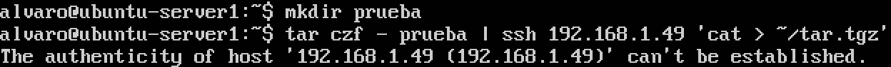
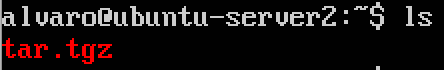
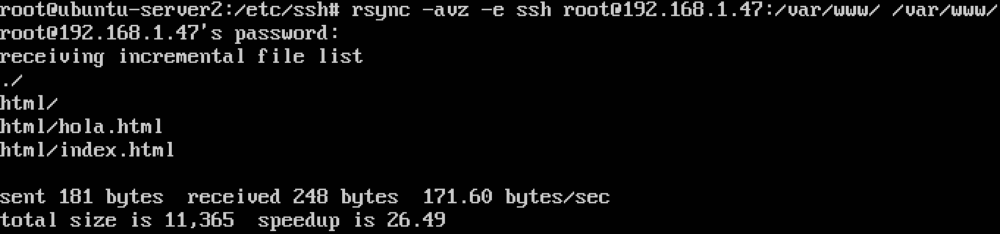
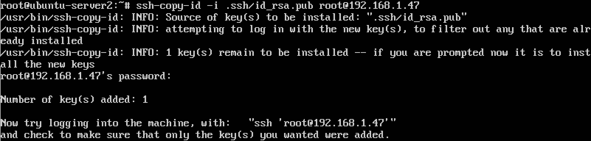
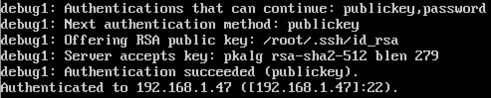
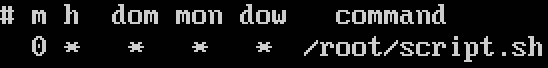
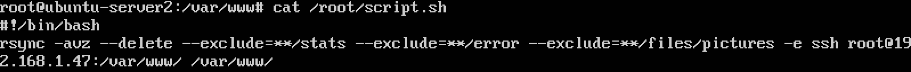
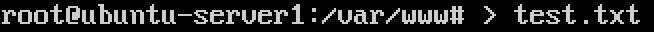
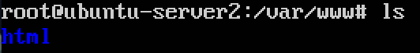
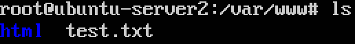

# Práctica 2. Clonar la información de un sitio web.

#### Indicaciones previas a la realización de la práctica
Antes de comenzar, creo que es preciso recordar las **IPs** de las dos máquinas utilizadas en esta práctica.  
- La **máquina 1** tiene la IP **192.168.1.47**
- La **máquina 2** tiene la IP **192.168.1.49**

En esta práctica, la máquina 2 se limitará a copiar el contenido del directorio */var/www/* de la máquina 1.

Dicho esto, ya estamos listos para comenzar la práctica.

#### Crear un tar con ficheros locales en un equipo remoto
Para realizar este apartado, en primer lugar creamos como ejemplo un directorio con el comando `mkdir prueba` y lo comprimimos con `tar czf - prueba | ssh 192.168.1.49 'cat > ~/tar.tgz'` como vemos en la siguiente imagen:  
  
Una vez hecho esto, se nos pedirá autorización para añadir la máquina 2 a la lista de hosts conocidos por la máquina 1:  
  
Comprobamos que efectivamente el archivo comprimido se encuentra en la máquina 2 con la orden `ls`:  
  

#### Instalar la herramienta rsync
En mi caso, la herramienta ya se encuentra instalada, pero he tenido que cambiar en el archivo de configuración **sshd_config** el parámetro `PermitRootLogin` que se encontraba por defecto con `prohibit-password` a `yes`:  

Como podemos observar, se han copiado una serie de archivos y directorios. En el último apartado veremos algunas capturas más detenidamente.  
Si queremos hacer un clonado más *estricto* por así decirlo, ejecutamos el siguiente comando (yo lo he hecho):  
`rsync -avz --delete --exclude=**/stats --exclude=**/error --exclude=**/files/pictures -e ssh root@192.168.1.47:/var/www/ /var/www/`  

#### Acceso sin contraseña para ssh
Al crear una clave del tipo **DSA** me he encontrado con un problema. Al realizar `ssh` con la opción `-v` he podido ver que este tipo de claves están obsoletas y son rechazadas. Tenemos dos opciones: o las permitimos, o bien creamos una clave del tipo **RSA**. Yo me he decantado por esto último.  
Creamos la clave con el comando `ssh-keygen -b 2048 -t rsa` y le damos a la tecla *enter* a todo lo que se nos pregunte sin tocar nada más (sin introducir ninguna contraseña).  
En el caso de tener algun problema de permisos, ejecutamos las siguientes ordenes: `chmod go-w $HOME $HOME/.ssh` y `chmod 600 $HOME/.ssh/authorized_keys` (En mi caso los he utilizado, pero no me ayudaron a resolver el problema que he comentado anteriormente).  
A continuación copiamos la **clave pública** en la máquina 1 con el comando `ssh-copy-id -i .ssh/id_rsa.pub root@192.168.1.47` como vemos en la siguiente captura:  
  
Una vez ya tenemos todo configurado, de nuevo con la opción `-v` de **ssh** podemos ver como si se acepta la clave pública:  
  

#### Programar tareas con crontab
Como las prácticas las voy a realizar con el usuario **root**, ejecuto el comando `sudo crontab -e`. Se nos preguntará que editor vamos a usar para modificar el archivo (yo siempre utilizo **nano**) y añadimos la línea `0 * * * * rsync -avz --delete --exclude=**/stats --exclude=**/error --exclude=**/files/pictures -e ssh root@192.168.1.47:/var/www/ /var/www/` para que se realice cada hora el clonado de la máquina 1 en la máquina 2.  
Al ser la orden tan larga, es posible que no se realice la tarea correctamente. La solución a esto es realizar un script con el comando y ejecutarlo en el crontab, tal como podemos ver en la siguiente imagen:
  
  
Para comprobar que la tarea se realiza satisfactoriamente, he creado un archivo llamado **test.txt** en la máquina 1:  
  
Antes de que se ejecute la tarea, el contenido del directorio **/var/www/** en la máquina 2 es el siguiente:  
  
Después de que se termine la tarea, podemos observar que el contenido del directorio ha variado:  

