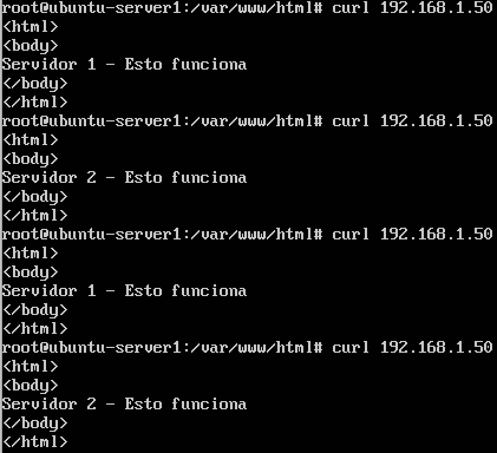
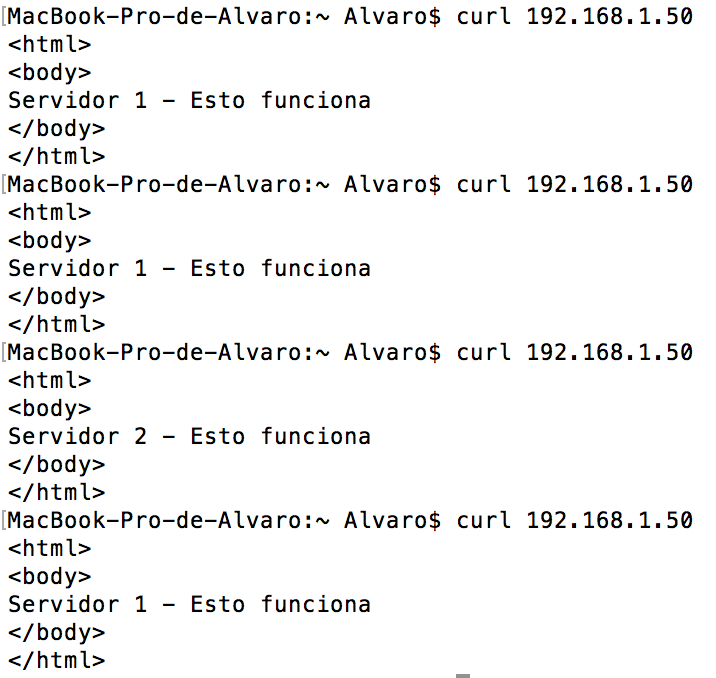
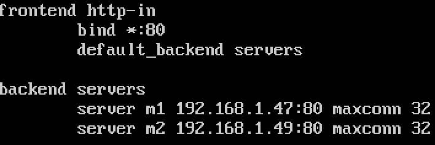
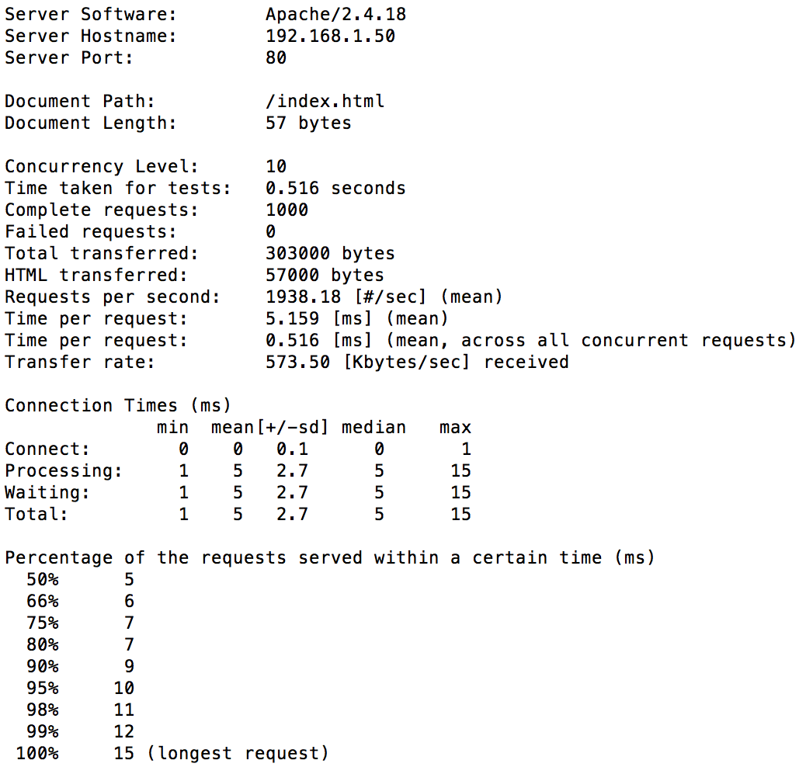
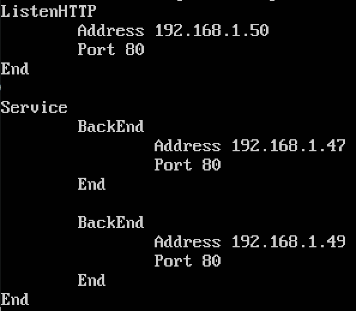
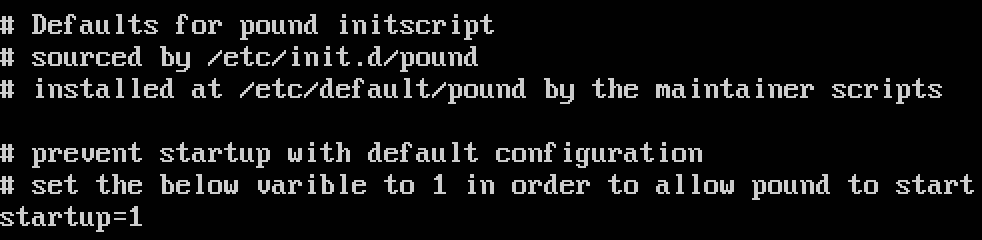
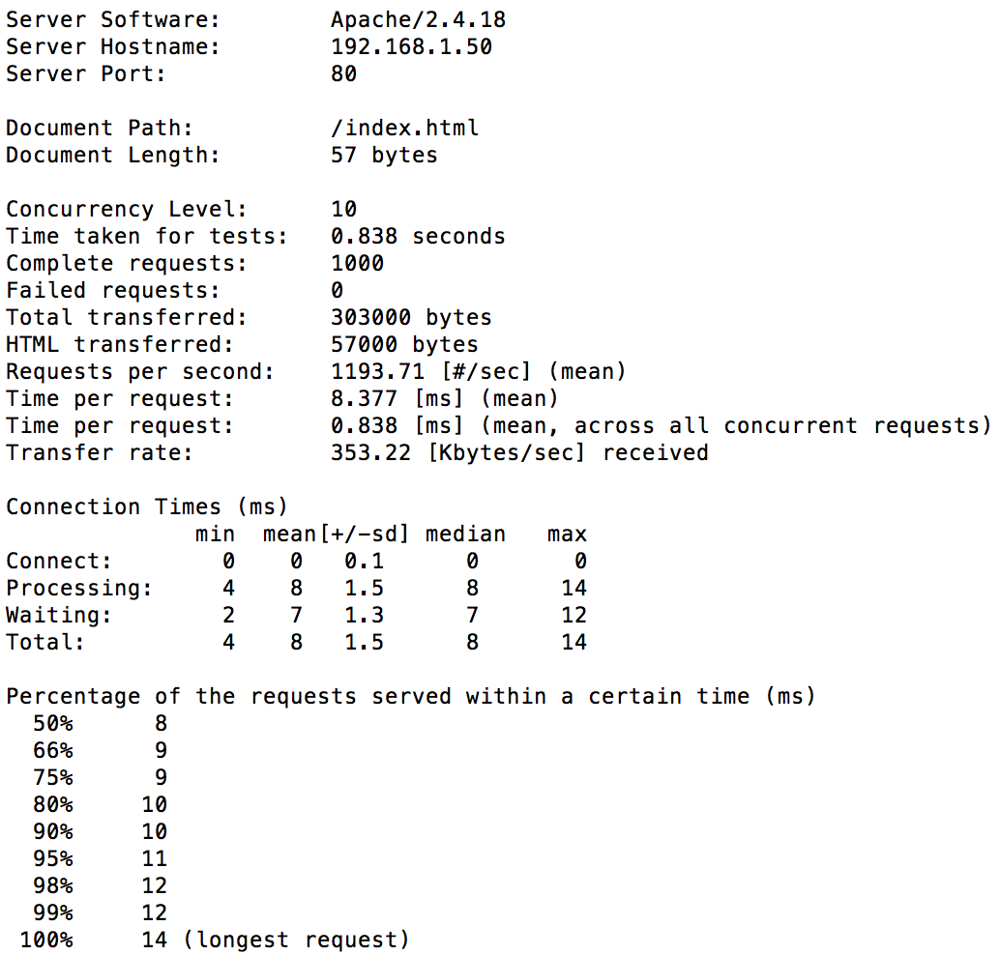

# Práctica 3. Balanceo de carga.

### Indicaciones previas a la realización de la práctica
Antes de nada, vamos a recordar las **IPs** de las tres máquinas utilizadas para esta práctica.  
- La **máquina 1** tiene la IP **192.168.1.47**
- La **máquina 2** tiene la IP **192.168.1.49**
- La nueva **máquina 3** (balanceador) tiene la IP **192.168.1.50**

Una vez aclarado esto, estamos preparados para comenzar la práctica.

### Balanceo de carga usando nginx
En primer lugar procedemos a instalar **nginx** en nuestra máquina 3 (que no debe tener **Apache** instalado).  
Una vez instalado, para realizar la configuración en mi caso he creado el archivo */etc/nginx/conf.d/default.conf*, ya que el archivo no existía por defecto.  
También es conveniente comentar la línea `#include /etc/nginx/sites-enabled/*;` en el caso de tener problemas (yo lo he hecho por si acaso).  
Si todo está bien, al realizar `sudo systemctl start nginx` no nos debería salir ningún error y al usar el comando `curl` obtendríamos algo tal que así:  
  
Como en el guión se nos pide asignarle mayor capacidad o peso a la máquina 1, debemos modificar el archivo mencionado anteriormente, dejándolo de la siguiente forma:  
")  
Reiniciamos el servicio y, si hemos configurado todo correctamente, la máquina 1 debería de atender dos peticiones antes de que la máquina 2 atienda una:  

### Someter a una alta carga el servidor balanceado (nginx)
Con la certeza de que el balanceador funciona correctamente, vamos a proceder a realizar el **Apache Benchmark**. Para ello, ejecutamos lo siguiente en la máquina host (para que no afecte al rendimiento de la máquina durante el test):  
  
Los resultados del benchmark de la máquina con nginx han sido los siguientes:  

### Balanceo de carga con haproxy
Ahora es el turno de configurar **haproxy**. Realizamos la instalación y no se nos debe olvidar parar el servicio de nginx para que no se solape con el de este balanceador.  
En el archivo */etc/haproxy/haproxy.cfg* introducimos lo que se nos dice en el guión, siendo lo más importante lo que vemos a continuación:  
  
De nuevo, de acuerdo con las exigencias del guión, le asignamos mayor peso a la máquina 1 de la siguiente forma:  
  
Iniciamos el servicio con `sudo /usr/sbin/haproxy -f /etc/haproxy/haproxy.cfg` y si todo se encuentra configurado correctamente, deberíamos obtener el mismo resultado al utilizar `curl` que con nginx.

### Someter a una alta carga el servidor balanceado (haproxy)
Con la certeza de que el balanceador funciona correctamente, vamos a proceder de nuevo a realizar el **Apache Benchmark**. Los resultados han sido los siguientes:  

### Tarea opcional: Balanceo de carga usando pound
Como tarea opcional he optado por instalar el balanceador **pound**. Los pasos a seguir son similares a los de los anteriores, si bien en este caso me ha resultado un poco más liosa la configuración (por motivos que explicaré a continuación).  
Realizamos la instalación con `sudo apt-get install pound` y paramos el servicio de haproxy.  
El archivo de configuración de este balanceador se encuentra en la ruta */etc/pound/pound.cfg* (no tiene pérdida).  
Debemos de configurar el archivo de esta forma:  
  
El principal contratiempo que he tenido al iniciar el servicio de este balanceador es que no basta con iniciarlo de la forma habitual (con `sudo systemctl start pound.service`), sino que además se debe modificar el archivo */etc/default/pound*, tal y como vemos en la siguiente imagen:  
  
Una vez que hemos establecido el valor de la opción `startup` a `1` se nos debe iniciar el servicio sin problemas, pudiendo pasar a realizar el Apache Benchmark.

### Tarea opcional: Someter a una alta carga el servidor balanceado (pound)

Los resultados al realizar el benchmark con el balanceador pound han sido los siguientes:  

### Conclusiones

Después de realizar los tests a todos los balanceadores (3 veces a cada uno, quedándome con el resultado medio de los tres), podemos ver como el más rápido ha sido **haproxy**, seguido de **nginx** y por último, **pound**.  
Del mismo modo, también es el más fácil de configurar de los tres, puesto que no dispone de tantas funcionalidades como nginx.  
El que menos me ha gustado ha sido pound ya que, además de su engorrosa configuración, es el más lento y usa una notación distinta a la hora de configurar la prioridad de cada máquina (con el parámetro *Priority*, que había olvidado comentar antes).