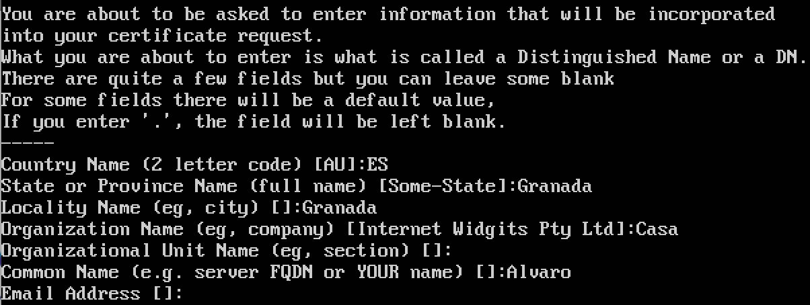
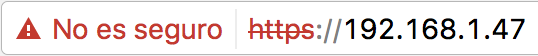
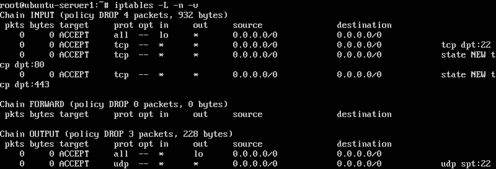
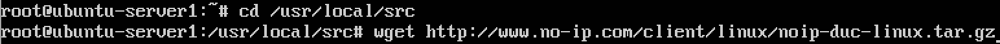
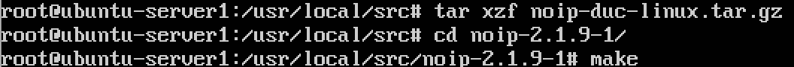
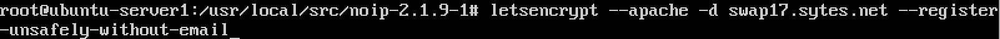

# Práctica 4. Asegurar la granja web.

### Instalar un certificado SSL autofirmado para configurar el acceso por HTTPS
Para instalar el certificado, seguimos los pasos del guión, introduciendo los siguientes comandos:  

`a2enmod ssl`  
`service apache2 restart`  
`mkdir /etc/apache2/ssl`  
`openssl req -x509 -nodes -days 365 -newkey rsa:2048 -keyout /etc/apache2/ssl/apache.key -out /etc/apache2/ssl/apache.crt`  

A continuación se nos pide aportar una serie de datos, aunque podemos dejar algunos en blanco, si así lo preferimos:  
  
Acto seguido, en el archivo */etc/apache2/sites-available/default-ssl* buscamos las líneas **SSLCertificateFile** y **SSLCertificateKeyFile**, modificando su contenido por **/etc/apache2/ssl/apache.crt** y **/etc/apache2/ssl/apache.key**, respectivamente.  

Por último, activamos el sitio con `a2ensite default-ssl` y reiniciamos **Apache**. Si todo ha ido bien, veremos lo siguiente al acceder mediante el protocolo **HTTPS**:  
  

Una vez que hemos comprobado que todo funciona correctamente repetimos el procedimiento con la **máquina 2**.

### Configuración del cortafuegos
Para realizar la configuración del firewall **iptables** he seguido el ejemplo del guión en el que se utiliza esta herramienta para configurar un servidor web. He ido añadiendo las siguientes reglas:  

`iptables -F`  
`iptables -X`  
`iptables -P INPUT DROP`  
`iptables -P OUTPUT DROP`  
`iptables -P FORWARD DROP`  
`iptables -A INPUT -i lo -j ACCEPT`  
`iptables -A OUTPUT -o lo -j ACCEPT`  
`iptables -A INPUT -p tcp --dport 22 -j ACCEPT`  
`iptables -A OUTPUT -p udp --sport 22 -j ACCEPT`  
`iptables -A INPUT -m state --state NEW -p tcp --dport 80 -j ACCEPT`  
`iptables -A INPUT -m state --state NEW -p tcp --dport 443 -j ACCEPT`  

Una vez hemos terminado, comprobamos que todas las reglas se han añadido satisfactoriamente con el comando `iptables -L -n -v`:  
  

Para no perder la nueva configuración que acabamos de realizar después de apagar la máquina, utilizamos la orden `iptables-save > /etc/network/iptables.rules`. Este fichero con las reglas lo recuperaremos cada vez que arranquemos la máquina con `iptables-restore < /etc/network/iptables.rules`.  
Para que las reglas se apliquen automáticamente en cada arranque, creamos un script llamado *iptables* en la ruta */etc/network/if-pre-up.d* que contenga dicho comando y le damos permisos de ejecución. Otra alternativa es instalar **iptables-persistent**.  

### Tarea opcional: Instalación de un certificado del proyecto Let's Encrypt
**Let's Encrypt** actúa únicamente sobre nombres de dominio, por lo que he utilizado un **Dynamic DNS** para crear un dominio de acuerdo con mi ip pública. Concretamente, he utilizado uno gratuito del proveedor **No-IP** ([Enlace](https://www.noip.com)).  
La instalación no resulta demasiado complicada. Voy a mostrar gráficamente los pasos que he seguido (para más detalle se puede dejar el ratón encima de las imágenes):  
  
  
. Acto seguido, introducimos el intervalo de actualización y si queremos ejecutar algo cuando esto pase.")  

**IMPORTANTE**: En el caso de que nos saliera algún error del tipo usuario o contraseña incorrecta debemos de esperar unos minutos hasta que nuestro dominio sea visible para el proveedor y repetir la instalación.  

Para la instalación de Let's Encrypt realizamos `sudo apt-get install python-letsencrypt-apache`. Una vez ha finalizado el proceso de instalación, lo ejecutamos:  
  
El **problema** que he tenido es que Let's Encrypt no consigue conectarse con el dominio a través de las máquinas virtuales. Por tanto, y después de habérselo comentado al profesor, se ha concluido con que no es posible de realizar esta tarea opcional.