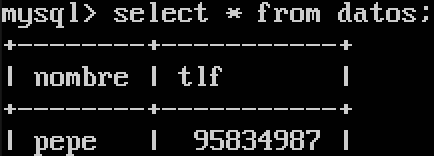
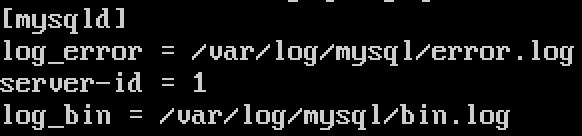
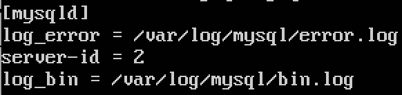
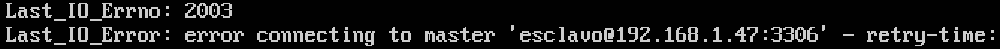
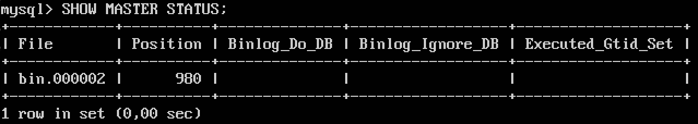

# Práctica 5. Replicación de bases de datos MySQL.

### Crear una BD e insertar datos
Creamos una base de datos siguiendo los pasos del guión, con nombre ***contactos*** y una tabla ***datos***, a la que insertamos una fila. Debemos tener algo como lo siguiente:  
   

### Replicar una BD MySQL con mysqldump.
Para guardar la base de datos que acabamos de crear y poder importarla en la máquina 2 utilizamos el comando `mysqldump contactos -u root -p > /tmp/contactos.sql`. Si queremos evitar que se produzca corrupción de datos en el caso de que se esté realizando una actualización en el momento en el que hacemos el respaldo, debemos bloquear la base de datos, introduciendo en el intérprete de MySQL `FLUSH TABLES WITH READ LOCK;`.  
Ahora ya sí podemos ejecutar el comando mencionado anteriormente. Una vez lo hayamos realizado, volvemos a desbloquear las tablas con `UNLOCK TABLES`.  
Si todo ha ido bien, deberíamos tener creado el **archivo sql** en la ruta especificada, así que usamos la herramienta **scp** para copiarlo a la máquina 2.  
Antes de importar el archivo en la máquina 2, debemos de crear la base de datos en dicha máquina. Una vez que la BD esté creada hacemos `mysql -u root -p contactos < /tmp/contactos.sql`.

### Replicación de BD mediante una configuración maestro-esclavo.
Para poder realizar la replicación de forma automática debemos editar el archivo */etc/mysql/my.cnf* de la siguiente forma:  
  
  
**IMPORTANTE**: Es necesario poner **[mysqld]** al comienzo o sino obtendremos un mensaje de error al reiniciar el servicio.  
En mi versión de Ubuntu Server, la línea que debemos comentar del **bind-address** se encuentra en otro archivo, concretamente en */etc/mysql/mysql.conf.d/mysqld.conf*. Si no tenemos esto en cuenta, obtendríamos el siguiente **error**:  
  
A continuación, **reiniciamos** el servicio de MySQL en ambas máquinas con `/etc/init.d/mysql restart`.  
Si todo ha ido bien no nos debería de salir ningún mensaje de error, así que vamos a la máquina 1 y entramos con nuestro usuario y contraseña de MySQL.  
Debemos ejecutar las siguientes sentencias, una tras otra:  
`CREATE USER esclavo IDENTIFIED BY 'esclavo';`  
`GRANT REPLICATION SLAVE ON *.* TO 'esclavo'@'%' IDENTIFIED BY 'esclavo';`  
`FLUSH PRIVILEGES;`  
`FLUSH TABLES`  
`FLUSH TABLES WITH READ LOCK;`  
Ahora debemos realizar `SHOW MASTER STATUS;` para obtener los datos del maestro y utilizarlos en el esclavo:  
  
En la máquina esclava ejecutamos la sentencia `CHANGE MASTER TO MASTER_HOST='192.168.1.47', MASTER_USER='esclavo', MASTER_PASSWORD='esclavo', MASTER_LOG_FILE='bin.000002', MASTER_LOG_POS=980, MASTER_PORT=3306;`, tal como vemos en la siguiente imagen:  
 la máquina maestra (máquina 1)")  
Por último iniciamos el esclavo con `START SLAVE` y volvemos a desbloquear las tablas en la máquina 1.  
En la máquina 2 comprobamos que todo se ha realizado correctamente con `SHOW SLAVE STATUS\G` y nos fijamos que el parámetro *Seconds_Behind_Master* sea distinto de **null**.

### Tarea opcional: Replicación de BD mediante una configuración maestro-maestro.
Para realizar la configuración maestro-maestro debemos repetir los pasos realizados anteriormente pero intercambiando los papeles entre las dos máquinas.  
De este modo, creamos un usuario en la máquina 2 exactamente igual al que habíamos creado en la máquina 1, realizando también el resto de sentencias.
Obtenemos los datos de la máquina 2 y los utilizamos en la sentencia `CHANGE MASTER TO MASTER_HOST='192.168.1.49', MASTER_USER='esclavo', MASTER_PASSWORD='esclavo', MASTER_LOG_FILE='bin.000003', MASTER_LOG_POS=980, MASTER_PORT=3306;` que esta vez se realizará en la máquina 1.  
Por último iniciamos el esclavo, que en este caso es la máquina 1, y nos fijamos de nuevo en el parámetro *Seconds_Behind_Master*.  
Ahora si introducimos una nueva fila en cualquiera de las dos máquinas, dicha fila debería de encontrarse replicada en la máquina opuesta.
