# Práctica 6. Discos en RAID.

### Configuración del RAID por software
En primer lugar, como dice en el guión, debemos de instalar **mdadm** y buscar la información de los dos discos duros que acabamos de añadir. Aquí podemos ver como quedan en la configuración de VirtualBox:  
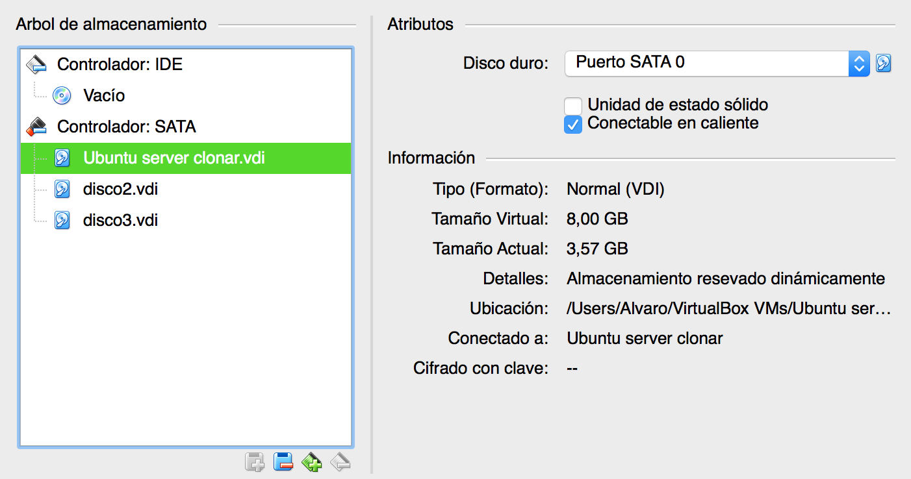  
Y aquí podemos ver los dos discos nuevos agregados, **/dev/sdb** y **/dev/sdc**:  
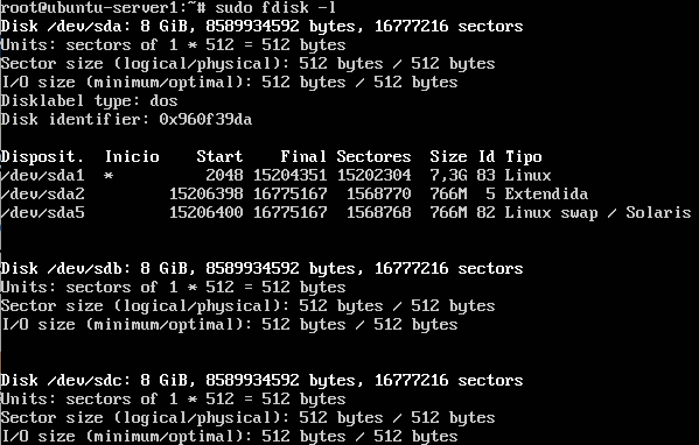  
Acto seguido, hacemos `sudo mdadm -C /dev/md0 --level=raid1 --raid-devices=2 /dev/sdb /dev/sdc` para crear el RAID y le damos formato con `sudo mkfs /dev/md0`.  
Ahora creamos un directorio para montar la unidad del RAID con el nombre **/dat** y lo montamos con `sudo mount /dev/md0 /dat`. Haciendo `mount` a secas nos debería salir lo siguiente:  
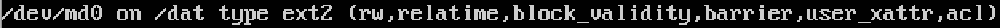  
Comprobamos el estado del RAID con `sudo mdadm --detail /dev/md0`. Los dos discos que hemos añadido aparecen funcionando:  
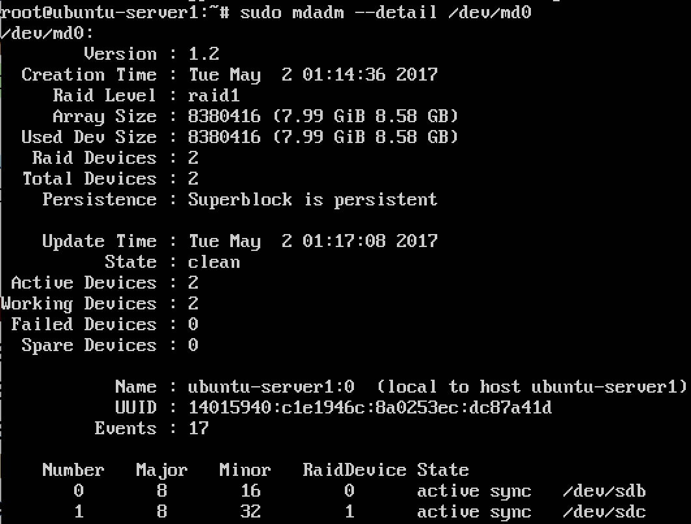  
Una vez que hemos revisado que todo funciona correctamente, debemos de automatizar el proceso en cada arranque del sistema. Para ello, obtenemos el **UUID** del dispositivo con `ls -l /dev/disk/by-uuid` y lo copiamos en el archivo **/etc/fstab**. La línea debe tener el formato **UUID /dat ext2 defaults 0 0**.  

Hacemos que el primer disco del RAID falle con el comando `sudo mdadm --manage --set-faulty /dev/md127 /dev/sdb` (al reiniciar la máquina el dispositivo md0 se renombra a **md127**). Nos saldrá el siguiente mensaje:  
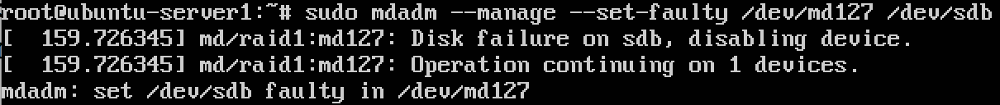  
Si mostramos los detalles con `sudo mdadm --detail /dev/md127`, vemos que nos queda un disco funcionando y otro que ha fallado:  
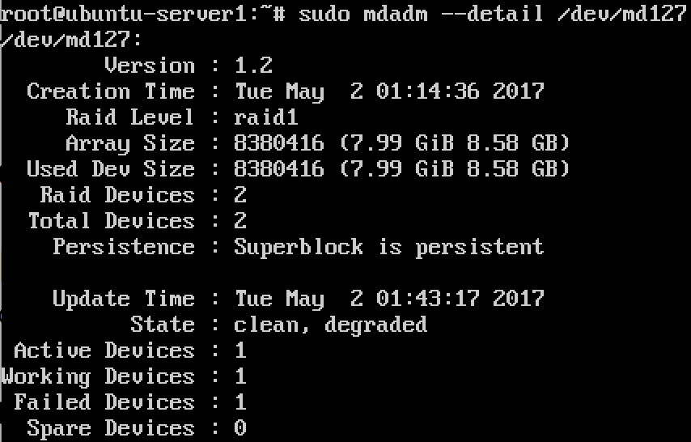  
Vamos a proceder a quitar el disco que ha fallado del RAID. Para ello ejecutamos la orden `sudo mdadm --manage --remove /dev/md127 /dev/sdb`:
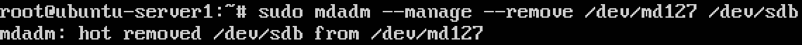  
Si volvemos a realizar `sudo mdadm --detail /dev/md127`, podemos ver que solo queda un disco en el RAID:  
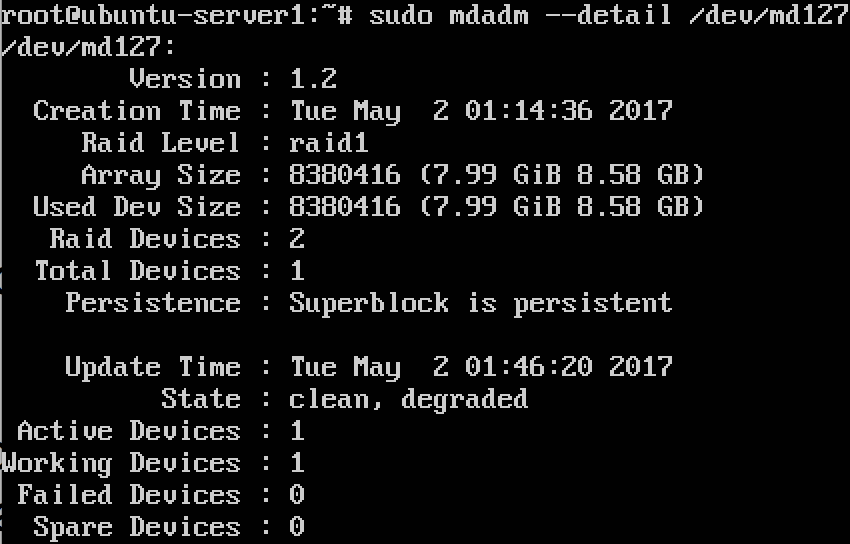  
Añadimos de nuevo el disco al RAID con `sudo mdadm --manage --add /dev/md127 /dev/sdb`. En la siguiente imagen podemos ver el proceso de reconstrucción:  
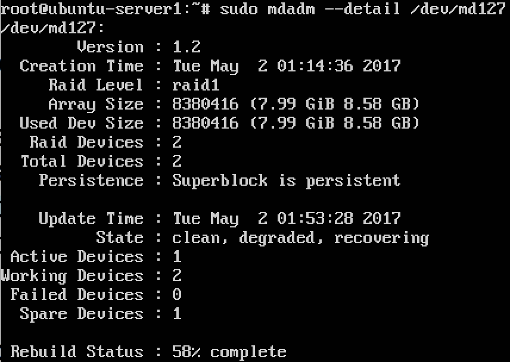  
Cuando finalice la reconstrucción, ambos discos volverán a estar activos como al principio:  
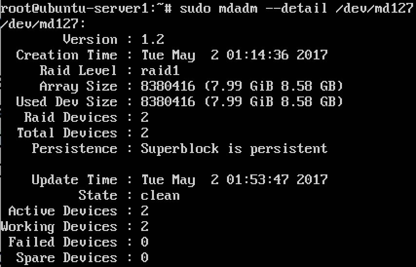  

### Tarea opcional: Configuración de servidor NFS
En primer lugar, en la máquina en la que hemos configurado el RAID, instalamos el paquete **nfs-kernel-server**.  
A continuación, cambiamos el dueño del directorio **/dat** con el comando `sudo chown nobody:nogroup /dat`.  
Editamos el archivo **/etc/exports** añadiendo lo siguiente:  
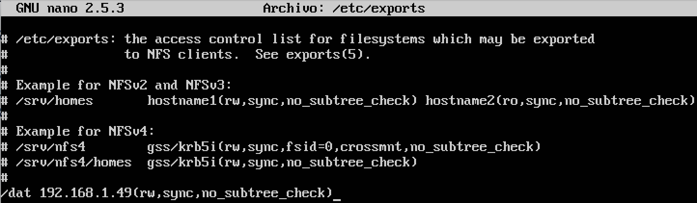  
La ip que indicamos en el archivo tiene que ser la de la máquina cliente. Por último reiniciamos el servicio con `sudo systemctl restart nfs-kernel-server.service`.  
Ahora vamos a la máquina que actuará como cliente e instalamos el paquete **nfs-common**. En mi caso he tenido un error con la librería *libapparmor-perl* que se ha solucionado haciendo `sudo apt-get install libapparmor-perl`.  
Creamos un directorio **/dat** en el cliente que nos servirá para montar el **/dat** del host. Una vez lo hemos creado, hacemos `sudo mount 192.168.1.47:/dat /dat`, siendo ésta la ip del servidor. Con la orden `mount` deberíamos de observar lo siguiente:  
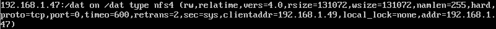  
Creamos un archivo de prueba en el directorio con `> /dat/prueba.txt` para comprobar que todo funciona correctamente. Si hacemos `ls -l` en el directorio */dat*, deberíamos tener algo como lo siguiente (en ambas máquinas):  
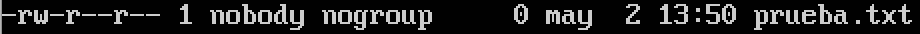  
Por último, para automatizar en el arranque todos los pasos que hemos realizado, editamos de nuevo el archivo **/etc/fstab** añadiendo esta línea:  
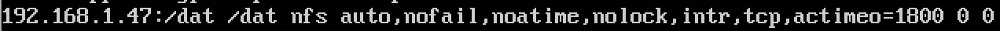